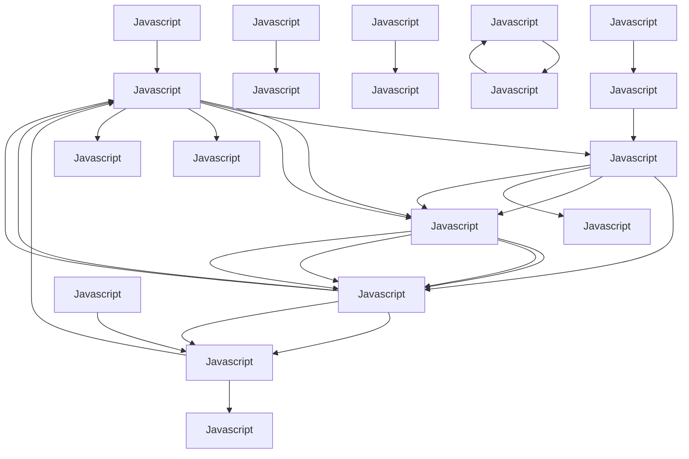

## My top used langs

## Time wasted

###

```mermaid
graph TD;
    id1[Javascript] --> id2[Javascript];
    id2[Javascript] --> id4[Javascript];
    id1[Javascript] --> id3[Javascript];
    id3[Javascript] --> id4[Javascript];
    id4[Javascript] --> id5[Javascript];
    id5[Javascript] --> id1[Javascript];
    id3[Javascript] --> id2[Javascript];
    id2[Javascript] --> id4[Javascript];
    id4[Javascript] --> id1[Javascript];
    id1[Javascript] --> id2[Javascript];
    id19[Javascript] --> id421[Javascript];
    id1[Javascript] --> id323[Javascript];
    id23[Javascript] --> id214[Javascript];
    id324[Javascript] --> id5[Javascript];
    id5[Javascript] --> id11[Javascript];
    id33[Javascript] --> id22[Javascript];
    id22[Javascript] --> id33[Javascript];
    id14[Javascript] --> id21[Javascript];
    id1[Javascript] --> id32[Javascript];
    id2[Javascript] --> id4[Javascript];
    id21[Javascript] --> id3[Javascript];
    id3[Javascript] --> id124[Javascript];
    id4[Javascript] --> id5[Javascript];
    id325[Javascript] --> id1[Javascript];
    id3[Javascript] --> id2[Javascript];
    id2[Javascript] --> id4[Javascript];
    id4[Javascript] --> id1[Javascript];
```

Contact Me @ toberock101@gmail.com

